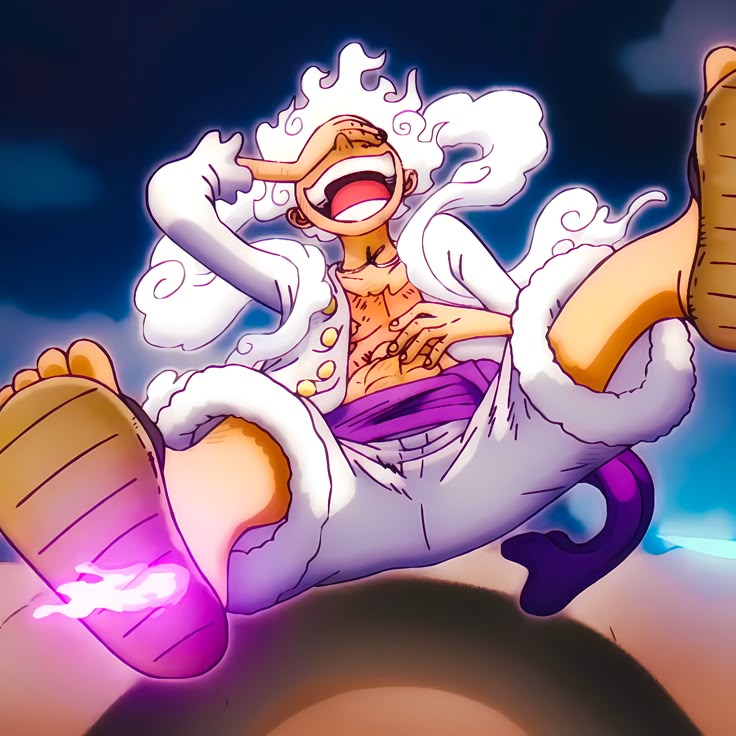

# MOMO.DEV // PORTFOLIO

> *Built to the beat. Deployed to the world.*

[](https://mehmomomo.github.io)
[]()
[]()

<p align="center">
  
</p>

---

## // ABOUT

Personal portfolio website for **Mehmet — Momo**. Built from scratch with pure HTML, CSS, and JavaScript. Cyberpunk aesthetic, bold typography, custom cursor, matrix rain, and smooth animations — no frameworks, no fluff.

---

## // FEATURES

- 🖥️ Cyberpunk / futuristic design
- 🌧️ Matrix rain background animation
- ⚡ Glitch effect on hero name
- 🖱️ Custom neon cursor with trailing ring
- 📺 CRT scanlines overlay
- 🎧 Built-in music player (Old-School Rap)
- 📱 Fully responsive
- 🚀 Zero dependencies

---

## // STACK

```
HTML  CSS  JavaScript  GitHub Pages
```

---

## // LIVE

🔗 **[mehmomomo.github.io](https://mehmomomo.github.io)**

---

## // CONTACT

- GitHub: [@mehmomomo](https://github.com/mehmomomo)
- Project: [Esthetics by Mamii](https://mehmetmomo.netlify.app)

---

<p align="center">© 2026 Mehmet — built to the beat 🎵</p>
